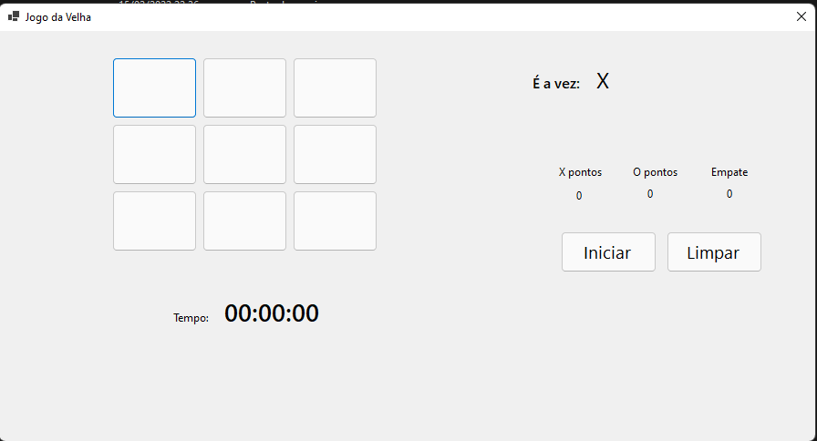

# 
Jogo da Velha com C# 

  

Desenvolvi um game bem simples do Jogo da Velha, contendo: tempo de jogo e vitórias.
 
Foi desenvolvido com Windows Forms e NET 5. 

  

Faço parte do grupo de estudos Corujinhas C# e esse desafio foi proposto para nós.
